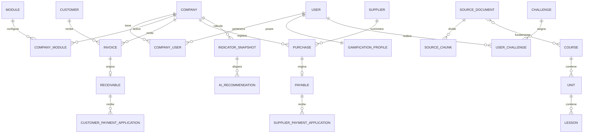

# 04 — Modelo de datos

## Convenciones

- IDs grandes (`bigint`) o UUID solo si existe una razón concreta; para hackathon `bigint` es suficiente.
- Dinero: `decimal(15,2)` o precisión acordada.
- Cada tabla empresarial relevante lleva `company_id` e índice.
- Fechas de negocio separadas de `created_at/updated_at`.
- Registros confirmados sensibles se anulan/archivan; no se eliminan físicamente.
- Agregar índices sobre `company_id`, estados, fechas, vencimientos y claves de búsqueda frecuente.

## Núcleo

### users

- id
- name
- email unique
- password
- active
- educational_preferences JSON nullable
- timestamps

### companies

- id
- name
- country_code
- currency_code
- timezone
- active
- timestamps

### company_user

- company_id
- user_id
- role_id o membership_role
- status
- joined_at

### roles / permissions

Puede implementarse con tablas propias simples o paquete aprobado. Debe existir autorización en servidor.

### modules

- id
- key unique (`sales`, `inventory`, etc.)
- name
- description
- active
- dependencies JSON

### company_modules

- company_id
- module_id
- enabled_at
- disabled_at nullable
- settings JSON nullable

### audit_logs

- company_id nullable
- user_id nullable
- module
- action
- auditable_type / auditable_id
- metadata JSON saneado
- created_at

## Sales

### customers
- company_id
- type
- name
- identifier nullable
- email/phone nullable
- credit_days nullable
- active

### items
- company_id
- type product|service
- sku
- name
- description nullable
- sale_price decimal
- cost decimal nullable
- track_stock boolean
- active

### invoices
- company_id
- customer_id
- number
- issue_date
- due_date nullable
- status
- payment_condition cash|credit
- subtotal
- discount_total
- tax_total
- total
- balance
- notes nullable
- issued_by
- annulled_by nullable
- annulled_at nullable
- annul_reason nullable

### invoice_lines
- invoice_id
- item_id nullable
- description snapshot
- quantity
- unit_price
- discount
- tax
- subtotal

## Inventory

### warehouses
- company_id
- name
- active

### stocks
- company_id
- warehouse_id
- item_id
- quantity
- min_quantity nullable

### inventory_movements
- company_id
- warehouse_id
- item_id
- type entry|exit|adjustment
- quantity
- unit_cost nullable
- source_type/source_id nullable
- reason nullable
- occurred_at
- user_id

## Purchases

### suppliers
- company_id
- name
- identifier nullable
- email/phone nullable
- active

### purchases
- company_id
- supplier_id
- number
- date
- due_date nullable
- condition cash|credit
- status
- subtotal/tax_total/total/balance
- created_by

### purchase_lines
- purchase_id
- item_id nullable
- description
- quantity
- unit_cost
- subtotal

## CxC / Cobros

### receivables
- company_id
- invoice_id
- original_amount
- balance
- due_date
- status

### customer_payments
- company_id
- customer_id
- cash_account_id nullable
- amount
- paid_at
- method
- reference nullable
- created_by

### customer_payment_applications
- customer_payment_id
- receivable_id
- amount

## CxP / Pagos

### payables
- company_id
- purchase_id
- original_amount
- balance
- due_date
- status

### supplier_payments
- company_id
- supplier_id
- cash_account_id nullable
- amount
- paid_at
- method
- reference nullable
- created_by

### supplier_payment_applications
- supplier_payment_id
- payable_id
- amount

## Cash

### cash_accounts
- company_id
- name
- type cash|bank_manual|wallet|other
- currency_code
- opening_balance
- active

### cash_movements
- company_id
- cash_account_id
- direction in|out
- amount
- category
- source_type/source_id nullable
- description
- occurred_at
- created_by

## Education / fuentes

### source_documents
- id
- institution
- title
- authors nullable
- url
- published_at nullable
- source_type
- usage_status link_only|excerpt_allowed|stored_allowed|review_required
- license_notes nullable
- active
- reviewed_by nullable
- reviewed_at nullable

### source_chunks
- source_document_id
- section_title nullable
- content
- locator nullable
- topic_tags JSON
- embedding nullable / reservado para evolución

### courses
- title
- description
- level
- objectives JSON
- active

### course_sources
- course_id
- source_document_id

### units
- course_id
- title
- description
- order
- objectives JSON

### lessons
- unit_id
- title
- lesson_type
- content
- order
- xp_reward

### lesson_sources
- lesson_id
- source_document_id
- locator nullable

### assignments
- lesson_id/unit_id nullable según diseño final
- title
- instructions
- rubric JSON
- difficulty
- xp_reward

### quizzes / quiz_questions / quiz_options
Guardar fuente y explicación de respuesta.

### learning_progress
- user_id
- course_id/unit_id/lesson_id según granularidad
- status
- score nullable
- attempts
- completed_at nullable

## Gamification

### gamification_profiles
- user_id unique
- xp_total
- level
- current_streak
- max_streak
- last_learning_activity_at

### achievements
- key
- name
- description
- criteria JSON
- xp_reward
- active

### user_achievements
- user_id
- achievement_id
- earned_at
- evidence JSON nullable

### challenges
- id
- source_document_id nullable
- generated_by_ai boolean
- prompt_template_version_id nullable
- title
- context
- instructions
- difficulty
- rubric JSON
- source_references JSON
- xp_reward
- active

### user_challenges
- user_id
- challenge_id
- status
- response nullable
- score nullable
- feedback nullable
- started_at/completed_at

## Intelligence

### indicator_definitions
- key
- name
- description
- formula_reference
- active

### indicator_snapshots
- company_id
- indicator_definition_id
- period_start/end
- value decimal
- metadata JSON
- calculated_at

### diagnostic_rules
- key
- indicator_key
- operator
- threshold
- severity
- learning_topic_key
- active

### ai_recommendations
- company_id
- user_id
- diagnostic_rule_id nullable
- indicator_snapshot_id nullable
- type
- title
- message
- severity
- target_type/target_id nullable
- status
- generated_at

### ai_conversations / ai_messages
Conservar contexto mínimo, rol, contenido y referencias; definir política de retención.

### prompt_templates
- key
- purpose
- version
- system_instructions
- input_schema JSON
- output_schema JSON
- active
- created_at

### ai_executions
- company_id nullable
- user_id nullable
- prompt_template_id
- provider
- model
- status
- input_metadata JSON saneado
- output_metadata JSON
- latency_ms nullable
- token_usage JSON nullable
- error_code nullable
- created_at

## Relaciones críticas

El ERD final debe refinarse durante migraciones, pero no debe romper las relaciones conceptuales anteriores.
